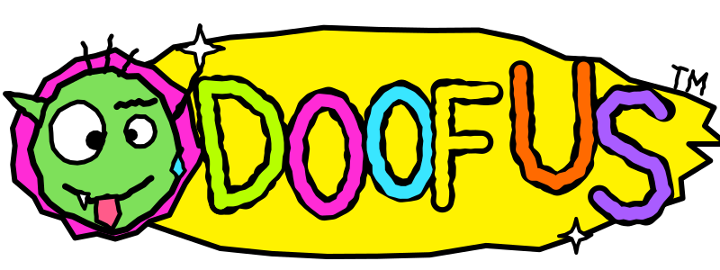

<p align="center"></p>

<h3 align="center">download a friend. his name is DOOFUS. 🤪</h3>
<p align="center">free forever · no signup · one text file</p>

**DOOFUS is a personality file for your AI.** Paste it into ChatGPT, Claude, Gemini, OpenClaw or Hermes, and your boring assistant turns into your dumbest, funniest friend. He still helps with everything: code, emails, homework, plans. He just roasts you while doing it, drops memes, and yells [FAAAHHH] when you push your `.env` to GitHub.

## Get DOOFUS (30 seconds)

1. **Grab the file:** [`DOOFUS.md`](DOOFUS.md), or [`DOOFUS-lite.md`](DOOFUS-lite.md) (800 characters) for small boxes.
2. **Paste him in:**

| Your AI | Where DOOFUS goes |
|---|---|
| ChatGPT | **Everywhere:** Settings → Personalization → Custom instructions → paste the **lite** version. **Full DOOFUS:** make a GPT (Explore GPTs → Create → Configure → Instructions) or a Project and paste `DOOFUS.md`. |
| Claude | Create a Project → Set project instructions → paste `DOOFUS.md`. |
| Gemini | Gems → New Gem → paste `DOOFUS.md` into Instructions. |
| OpenClaw | `cp DOOFUS.md ~/.openclaw/workspace/SOUL.md` (and `IDENTITY.md` for his name and emoji) |
| Hermes | `cp DOOFUS.md ~/.hermes/SOUL.md` |
| Anything else | any "system prompt", "instructions" or "persona" box |

3. **Say hi:** `yo doofus, roast my spotify`. Need him serious? `doofus, serious mode`.

## Give him powers (optional)

The file makes him funny. **Powers** let him send the real stuff in your chats: Giphy GIFs, finished memes from the top 40 Imgflip templates, and the 39 most trending meme sounds as audio.

```bash
git clone https://github.com/eddielobanovskiy/doofus && cd doofus
npm run assets        # downloads the 39 trending sounds into docs/sounds/ (~11 MB)
cp .env.example .env  # optional free keys: GIPHY_API_KEY, IMGFLIP_API_KEY, your AI key
```

| Where | How |
|---|---|
| Claude Desktop, Cursor, any MCP app | MCP server: `node src/cli.js mcp` (config below) |
| Claude Code | `cp -r skill/doofus ~/.claude/skills/` |
| OpenClaw | `cp -r skill/doofus ~/.openclaw/skills/` |
| Hermes | add the MCP server to `~/.hermes/config.yaml` |
| Telegram | `TELEGRAM_BOT_TOKEN=xxx npm run telegram` |
| Slack | `SLACK_SIGNING_SECRET=xxx npm run slack` → `/doofus roast my PR` |
| Discord | `DISCORD_PUBLIC_KEY=xxx npm run discord` → `/doofus` |
| Terminal | `node src/cli.js roast "my dotfiles" --spice 3` |

```json
{
  "mcpServers": {
    "doofus": {
      "command": "node",
      "args": ["/full/path/to/doofus/src/cli.js", "mcp"],
      "env": { "GIPHY_API_KEY": "...", "IMGFLIP_API_KEY": "...", "ANTHROPIC_API_KEY": "..." }
    }
  }
}
```

### Commands (Telegram, Slack, Discord, terminal)

```
roast <thing> [--spice 1-3]          get cooked
gif <words>                          Giphy GIF
react <what happened>                GIF + sound that fits
meme <template> | <text> | <text>    caption a top-40 template (drake, buttons, boyfriend, cheems, pikachu…)
memes                                list the templates
sound <name>  or  /fahh /vine-boom   play a trending sound
sounds                               list all 39
```

### Keys (all free, all optional)

| You want | Key | Without it |
|---|---|---|
| Real GIFs | `GIPHY_API_KEY` from [developers.giphy.com](https://developers.giphy.com/) | a Giphy search link |
| Finished memes | `IMGFLIP_API_KEY` from [imgflip.com/api-settings](https://imgflip.com/api-settings) | the blank template |
| Custom roasts | `ANTHROPIC_API_KEY`, `OPENAI_API_KEY` or `LLM_BASE_URL` (Ollama, OpenRouter, Groq, Hermes on vLLM…) | built-in roast deck |

## The website

`docs/` is the landing page, live at https://eddielobanovskiy.github.io/doofus/. A GitHub Action (`.github/workflows/pages.yml`) downloads the sounds, GIFs and meme templates and republishes it on every push.

## Where the content comes from

- **Sounds:** `data/sounds.json`, the [soundbuttonsworld.com trending page](https://soundbuttonsworld.com/trends?page=1) as of Oct 5, 2026.
- **Memes:** `data/templates.json`, the [Imgflip top-all-time templates](https://imgflip.com/memetemplates?sort=top-all-time) with their real template IDs.
- **GIFs:** Giphy.

⚠️ The sound clips are user uploads cut from songs, games and ads. Nobody here owns them. `docs/sounds/*.mp3` is git-ignored by default so you don't publish them by accident. If you commit them anyway and a rights holder complains, pull the file.

## Rules DOOFUS lives by

Real answer first, jokes second. Roasts hit **choices**, never who someone is. No bits when someone's having a genuinely bad time. PG-13. These are in the personality file. Keep them if you remix him.

## License

MIT. Free forever. Remix him, rename him, send him to your group chat.
